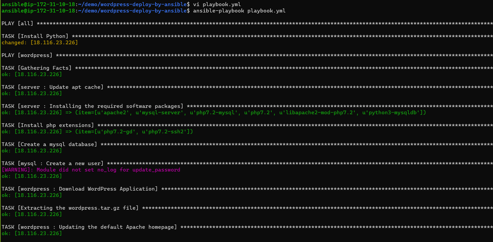
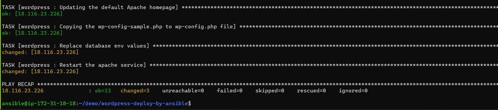
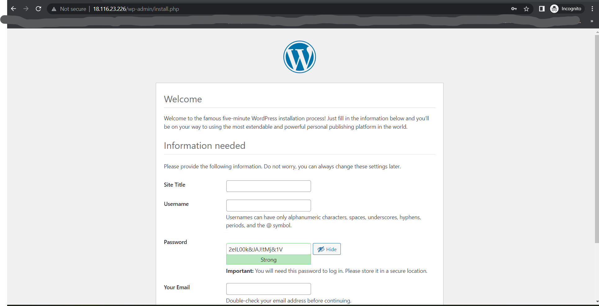
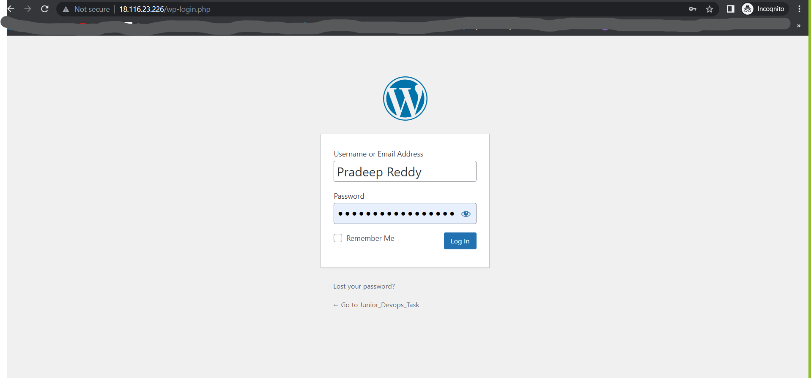
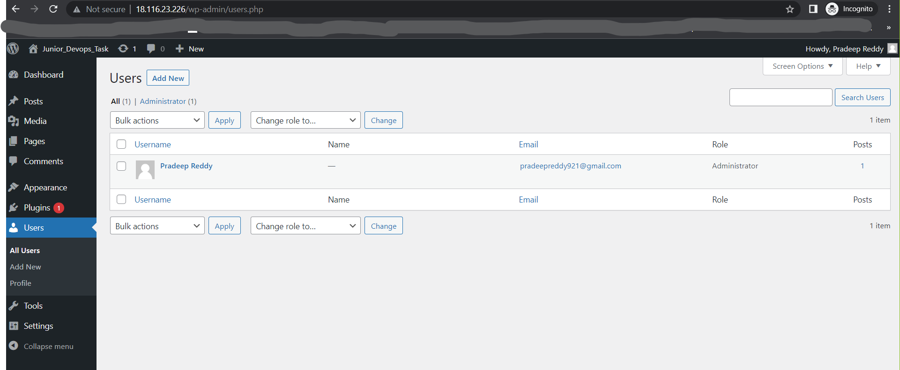
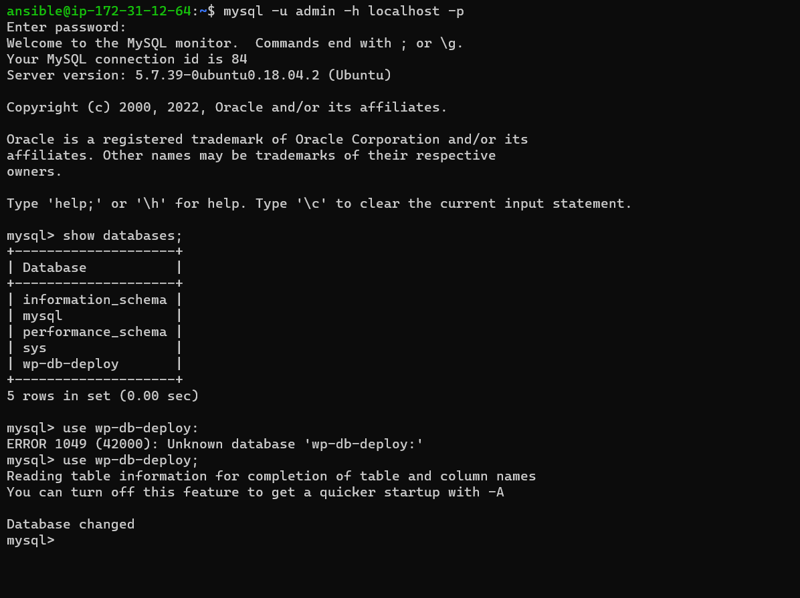

## Installation & Configuration of Ansible in Ubuntu 18.04 

1. Execute the command to install official PPA (personal package archive) in your system’s list of sources:
    
   ```
   sudo apt-add-repository ppa:ansible/ansible -y
   ```
2. Now, Update the apt package repository:
   ```
   sudo apt udpate -y
   ```

3. Now, Execute the command to install ansible:
   ```
   sudo apt install ansible -y
   ```

4. Verify the ansible installation by executing the command:
   ```
   ansible --version
   ```

## Configuration of Ansible Master & Worker Nodes:

5. Create **ansible** user and provide **sudo** access in all servers.

    - Create a user with the name `ansible` and set password for that user by using `passwd` command:
      ```
      sudo adduser ansible  --> User creation
  
      sudo passwd ansible   --> Password setup for that user
      ```

    - Make the necessary entry in sudoers file /etc/sudoers for ansible user for password-less sudo access:
      ```
      sudo visudo

      ansible ALL=(ALL) NOPASSWD: ALL
      ```
    - Make the necessary changes  in sshd_config file /etc/ssh/sshd_config to enable password based authentication:
      ```
      sudo vi /etc/ssh/sshd_config
    
      PasswordAuthentication no => PasswordAuthentication yes
      ```
    - Now, Restart the `sshd` service:
      ```
      sudo service sshd restart
      ```

6. In the ansible master node, Switch to `ansible` user and Create a ssh-key by using the `ssh-keygen` command:
   ```
   sudo su - ansible  => Switch to ansible user

   ssh-keygen         => sshkey creation
   ```

7. Now, Copy the public-key to ansible worker node for ansible user:
   ```
   ssh-copy-id ansible@<ansible-worker-node-ip>
   ``` 

8. Since, We are copying the public key to worker node for the 1st time. It will ask password, Give the password correctly, Then the public key will be copied to worker node successfully.

9. Now, Get the private-ip of worker node and add hat value to the hosts inventory file:
   ```
   sudo vi /etc/ansible/hosts

   [wordpress-deploy]
   <ip-address>

   [all:vars]
   ansible_python_interpreter=/usr/bin/python3
   ```
10. Then execute the following command to test the connection b/w master and worker nodes:
    ```
    ansible all -m ping
    ```

11. If we see the above message, Then we can say that master node is able to connect with worker node.

## Deployment of WordPress using Ansible Playbook

* Application Dependencies: MySQL, PHP, Apache2, WordPress

12. First, Created a sample directory named wordpress_task and within that directory created another directory named `roles` and a file i.e; playbook.yml
    ```
    mkdir -p wordpress_task/roles && touch wordpress_task/playbook.yml
    ```

13. Now, Go to the directory (wordpress_task) and add the following content:
    ```
    cd wordpress_task 

    vi playbook.yaml

    - hosts: all
      gather_facts: False
      become: yes
      tasks: 
      - name: Install Python
        raw: test -e /usr/bin/python || (apt -y update && apt install -y python3-minimal)
        
    - hosts: wordpress-deploy
      roles: 
        - server
        - php
        - mysql
        - wordpress
    ```

14. Now, Go to the `roles` directory and execute the  following commands to create roles for the following packages i.e; server, php, mysql and wordpress:
    ```
    cd roles

    ansible-galaxy init server

    ansible-galaxy init php

    ansible-galaxy init mysql

    ansible-galaxy init wordpress
    ```
15. Go to `server` directory and add the following content inside `main.yml` file under tasks directory:
    ```
    vi server/tasks/main.yml

    ---
    # tasks file for server 
    - name: Update apt cache
      apt: update_cache=yes cache_valid_time=3600
      become: yes

    - name: Installing the required software packages
      apt: name={{ item }} state=present
      become: yes
      with_items:
        - apache2
        - mysql-server
        #- python3-pip
        #- libmysqlclient-dev
        - php7.2-mysql
        - php7.2
        - libapache2-mod-php7.2
        - python3-mysqldb
    ```

16. Now, Go to the `php` directory and add the following content inside `main.yaml` file under `tasks` directory:
    
    ```
    cd ../..

    vi php/tasks/main.yml

    ---
    # tasks file for php
    - name: Install php extensions
      apt: name={{ item }}  state=present
      become: yes
      with_items: 
        - php7.2-gd
        - php7.2-ssh2
    ```

17. Now, Go to the `mysql` directory and add the following content inside `main.yml` under `defaults` directory:
    ```
    vi mysql/defaults/main.yml

    ---
    # defaults file for mysql
    wp_mysql_db: wp-db-deploy
    wp_mysql_user: admin
    wp_mysql_password: Abcdef@123!
    ```

18. Now, Open the `main.yml` file under the `tasks` directory w.r.to `mysql` folder and add the following content:
    ```
    --- 
    - name: Create a mysql database
      mysql_db: name={{ wp_mysql_db }} state=present 
      become: yes

    - name: Create a new user
      no_log: true
      mysql_user:
        name={{ wp_mysql_user }}
        password={{ wp_mysql_password }}
        priv='*.*:ALL'
      become: yes
    ```

19. Now, Open the `main.yml` under the `tasks` directory w.r.to `wordpress` folder and add the following content:
    ```
    ---
    # tasks file for wordpress
    - name: Download WordPress Application
      get_url: 
        url=https://wordpress.org/latest.tar.gz 
        dest=/tmp/wordpress.tar.gz
        validate_certs=no

    - name: Extracting the wordpress.tar.gz file
      unarchive: src=/tmp/wordpress.tar.gz dest=/var/www/ copy=no
      become: yes

    - name: Updating the default Apache homepage
      become: yes
      lineinfile: 
        dest=/etc/apache2/sites-enabled/000-default.conf 
        regexp="(.)+DocumentRoot /var/www/html"
        line="DocumentRoot /var/www/wordpress"
      #notify: 
       # - restart apache
       
    - name: Restart the apache service
      service: name=apache2 state=restarted
      become: yes

    - name: Copying the wp-config-sample.php to wp-config.php file
      command: mv /var/www/wordpress/wp-config-sample.php /var/www/wordpress/wp-config.php creates=/var/www/wordpress/wp-config.php
      become: yes

    - name: Replace database env values
      shell: |
        sed -i "s/database_name_here/{{wp_mysql_db}}/" /var/www/wordpress/wp-config.php
        sed -i "s/username_here/{{wp_mysql_user}}/" /var/www/wordpress/wp-config.php
        sed -i "s/password_here/{{wp_mysql_password}}/" /var/www/wordpress/wp-config.php
      become: yes

    - name: Restart the apache service
      service: name=apache2 state=restarted
      become: yes
    ```

20. Now, Open the `main.yml` under the `handlers` directory w.r.to `wordpress` directory and add the following content:
    ```
    ---
    # handlers file for wordpress
    #- name: Restart the apache service
     # service: name=apache2 state=restarted
      #become: yes
    ```

21. Execute the below command to deploy the wordpress application to worker node:
    ```
    ansible-playbook playbook.yml
    ```
    
    

    

    - If the script throws `permission denied error` then use the `-K` flag along with the above command and give the password for ansible user w.r.to `worker` node.
      ```
      ansible-playbook playbook.yml -K
      ```

22. If the playbook executed successfully, Then you can access the wordpress application by entering the ip-address of worker node along with port '80' [Make sure port number 80 is opened in the security group of worker node].
    ```
    http://<worker-node-ip>:80
    ```
    

    

    

## Verification of MySQL installation:

23. Login to `worker` node and switch to `ansible` user:
    ``` 
    sudo su - ansible
    ```

24. Execute the command to enter the `mysql` cli:
    ```
    mysql -u <username> -h <hostname> -p
    ```

25. Execute the following commands to get more details related to **mysql**:
    
    ```
    show databases;        => To display all databases

    use <database-name>;   => Switch to particular database

    show tables;           => Display tables related to a particular database

    describe <table-name>; => Display information related to a particular table
    ```

    

